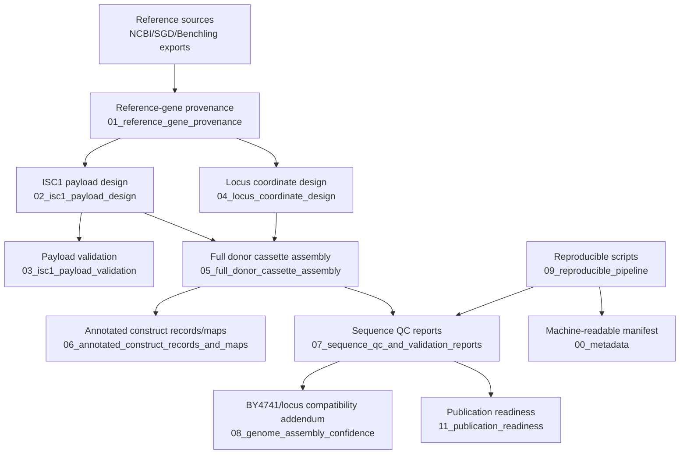
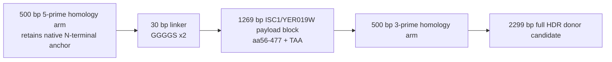

# Visual design models

These diagrams are computational documentation only. They summarize the repository workflow and donor architecture, but they do not demonstrate yeast transformation, integration, expression, extracellular-vesicle phenotype, peptide loading, BBB delivery, or therapeutic function.

## Repository workflow model

## Donor architecture model

